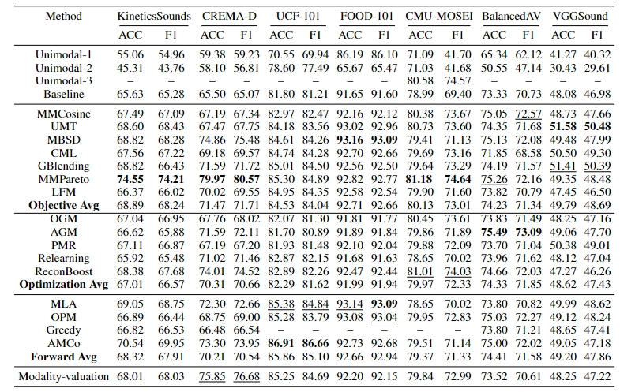

# BalanceBenchmark: A Survey for Multimodal Imbalance Learning

## Paper
[**BalanceBenchmark: A Survey for Multimodal Imbalance Learning**](http://arxiv.org/abs/2502.10816)<br>
Shaoxuan Xu, Menglu Cui, Chengxiang Huang, Hongfa Wang and Di Hu

If you find this repository useful, please cite our paper and corresponding toolkit:
```bibtex
@misc{xu2025balancebenchmarksurveymultimodalimbalancelearning,
      title={BalanceBenchmark: A Survey for Multimodal Imbalance Learning}, 
      author={Shaoxuan Xu and Menglu Cui and Chengxiang Huang and Hongfa Wang and Di Hu},
      year={2025},
      eprint={2502.10816},
      archivePrefix={arXiv},
      primaryClass={cs.LG},
      url={https://arxiv.org/abs/2502.10816}, 
}
```

## Overview


Multimodal learning has gained attention for its capacity to integrate information from different modalities. However, it is often hindered by the multimodal imbalance problem, where certain modalities disproportionately dominate while others remain underutilized. Although recent studies have proposed various methods to alleviate this problem, they lack comprehensive and fair comparisons.
To facilitate this field, we introduce BalanceBenchmark, a systematic and unified benchmark for evaluating multimodal imbalance learning methods. BalanceBenchmark spans 17 algorithms and 7 datasets, providing a comprehensive framework for method evaluation and comparison.

To accompany BalanceBenchmark, we release **BalanceMM**, a standardized toolkit that implements 17 state-of-the-art approaches spanning four research directions: data-level adjustments, feed-forward modifications, objective adaptations, and optimization-based methods. The toolkit provides a standardized pipeline that unifies innovations in fusion paradigms, optimization objectives, and training approaches.
Our toolkit simplifies the research workflow through:

+ Standardized data loading for 7 multimodal datasets
+ Unified implementation of various imbalance learning methods
+ Automated experimental pipeline from training to evaluation
+ Comprehensive metrics for assessing performance, imbalance degree, and complexity

BalanceMM is designed with modularity and extensibility in mind, enabling easy integration of new methods and datasets. It provides researchers with the necessary tools to reproduce experiments, conduct fair comparisons, and develop new approaches for addressing the multimodal imbalance problem.
## Datasets currently supported
+ Audio-Visual: KineticsSounds, CREMA-D, BalancedAV, VGGSound
+ RGB-Optical Flow: UCF-101
+ Image-Text: FOOD-101
+ Audio-Visual-Text: CMU-MOSEI

To add a new dataset:

1. Go to `balancemm/datasets/`
2. Create a new Python file and a new dataset class
3. Implement the required data loading and preprocessing methods in the `corresponding_dataset.py` file
4. Add configuration file in `balancemm/configs/dataset_config.yaml`

## Algorithms currently supported
+ Data-level methods: Modality-valuation
+ Feed-forward methods: MLA, OPM, Greedy, AMCo
+ Objective methods: MMCosine, UMT, MBSD, CML, MMPareto, GBlending, LFM
+ Optimization methods: OGM, AGM, PMR, Relearning, ReconBoost

See Section 3 in our paper for detailed descriptions of each method.


To add a new method:

1. Determine which category your method belongs to:
  + "Data" : methods that adjust data processing
  + "Feed-forward" : methods that modify network architecture
  + "Objective" : methods that adapt learning objectives
  + "Optimization" : methods that adjust optimization process
2. Go to `balancemm/trainer/`
3. Create a new Python file implementing your method
4. Implement the `corresponding_trainer.py` file based on `base_trainer.py`, you should rewrite `trainer.training_step` usually.
5. Other implementation by your method's category:
  + If your method belongs to "Data", go to `balancemm/datasets/__init.py` and modify properly.
  + If your method belongs to "Feed-forward", go to `balancemm/models/avclassify_model.py`, create a new model class and rewrite specific functions.
  + If your method belongs to "Objective", you mostly don't have to do other modification except traienr.
  + If your method belongs to "Optimization", you may need to modify trainer or any parts mentioned above.
  + You can also modify any combination of the parts metioned above according to your method.
6. Add configuration file in `balancemm/configs/trainer_config.yaml`
## Installation
```
git clone https://github.com/GeWu-Lab/BalanceBenchmark.git
cd BalanceBenchmark
conda create -n balancemm python=3.10
conda activate balancemm
pip install torch==1.12.1+cu113
pip install -r requirements.txt
pip install lightning==2.0.0
pip install lightning-cloud==0.5.68
pip install lightning-utilities==0.11.2
```
## Experiment
To run experiments, you'll need to download the datasets from their open-sourced links. After downloading, place the datasets in your preferred directory and update the dataset path in your configuration file. 

You can run any experiment using a single command line:
```
python -m balancemm \
    --trainer [trainer_name] \
    --dataset [dataset_name] \
    --model [model_name] \
    --hyper-params [param_file.yaml] \
    --device [0/cpu]
```
For example, to run OGM on CREMA-D dataset:
```
python -m balancemm \
    --trainer OGM \
    --dataset CREMAD \
    --model BaseClassifier \
    --alpha 0.5 \
    --device 0
```
## Results
We have conducted comprehensive experiments using the proposed BanlenceBenchmark on 7 datasets. The results indicate that almost all related methods outperform the Baseline in terms of accuracy and F1 score, demonstrating that the multimodal imbalance problem is prevalent across various scenarios. 



